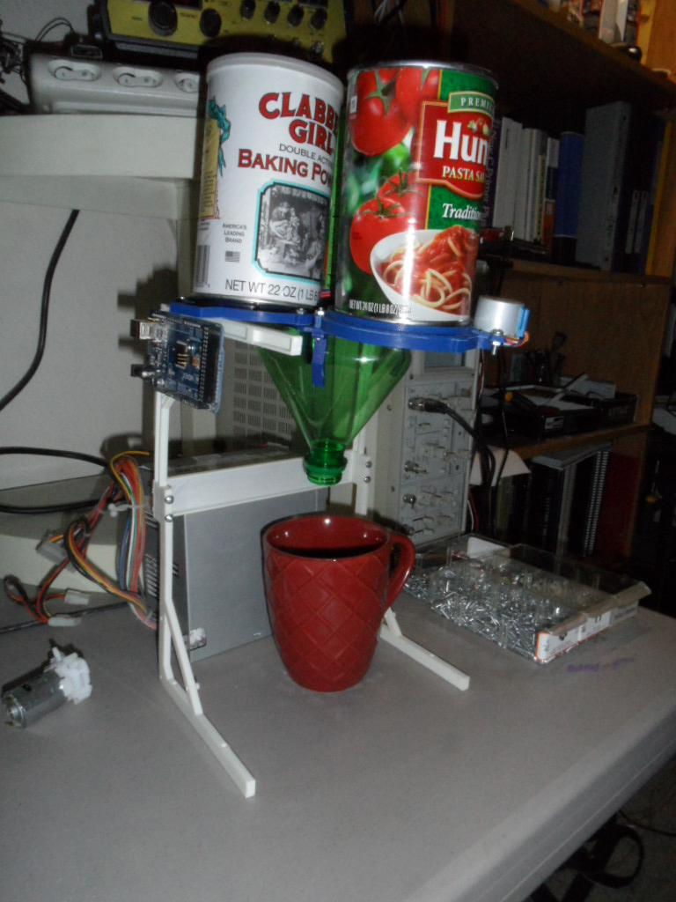

#Building the ArdiChef
### Model-100

-------------------------------------------------------------------------------------
#Introduction
-------------------------------------------------------------------------------------
The ArdiChef-100 is the 1st ArdiChef release and is extremely simple.

- Features
    - 3-Dry Ingredient Dispensing (*Examples Uses; Simple Pancakes, Coffee Subliments*)
    - 3D Printed Stand
        - 11-1/4" Heigh x 8" Wide x 10-1/2" Deep (*With Power Supply*)
        - 6-1/2" Nozzle Clearance
        

-------------------------------------------------------------------------------------
#Required Materials
-------------------------------------------------------------------------------------
- (3) PD-FBD-28BYJ-83MM Food Dispensers (*see README in /dispensers/PD-PowderDispensers/PD-FBD-28BYJ-86MM/README.md*)
- (3) Tin Cans with 83mm Diameter (*Hunts Pasta Sauce, Cambells Family Size*)
- Arduino Board
- Arduino Ethernet Shield with SD-Card
- SD-Card
- Ethernet Cable
- 2-Liter Soda Pop Bottle
- PC Power Supply

-----------------------------------------------------------------------------------
##Assembly
-----------------------------------------------------------------------------------
1. Prepare (3) PD-FBD-28BYJ-83MM Food Dispensers
2. Using a Can Opener remove both ends of Selected Canisters
3. 
