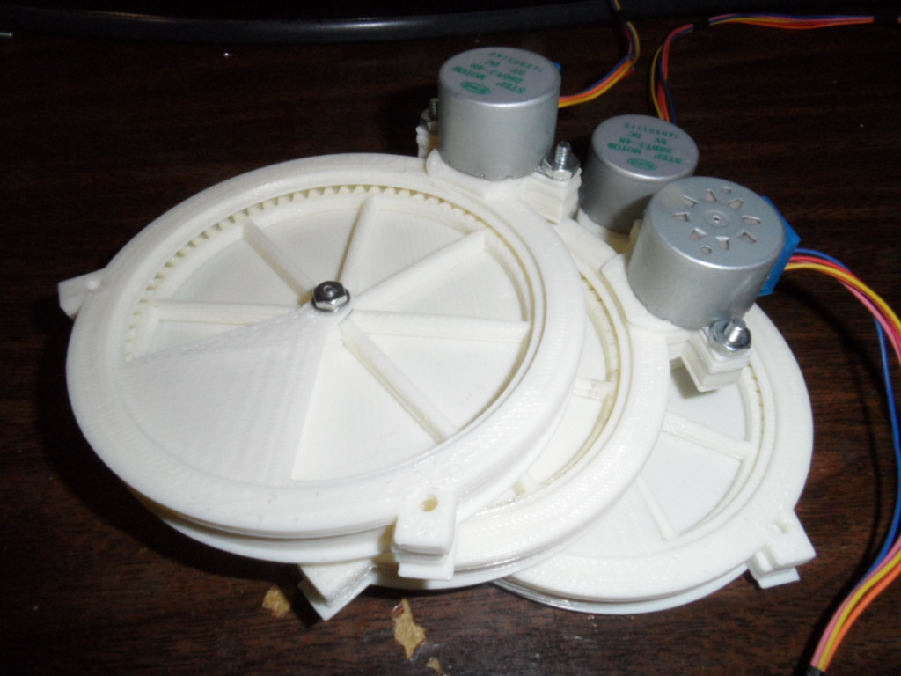
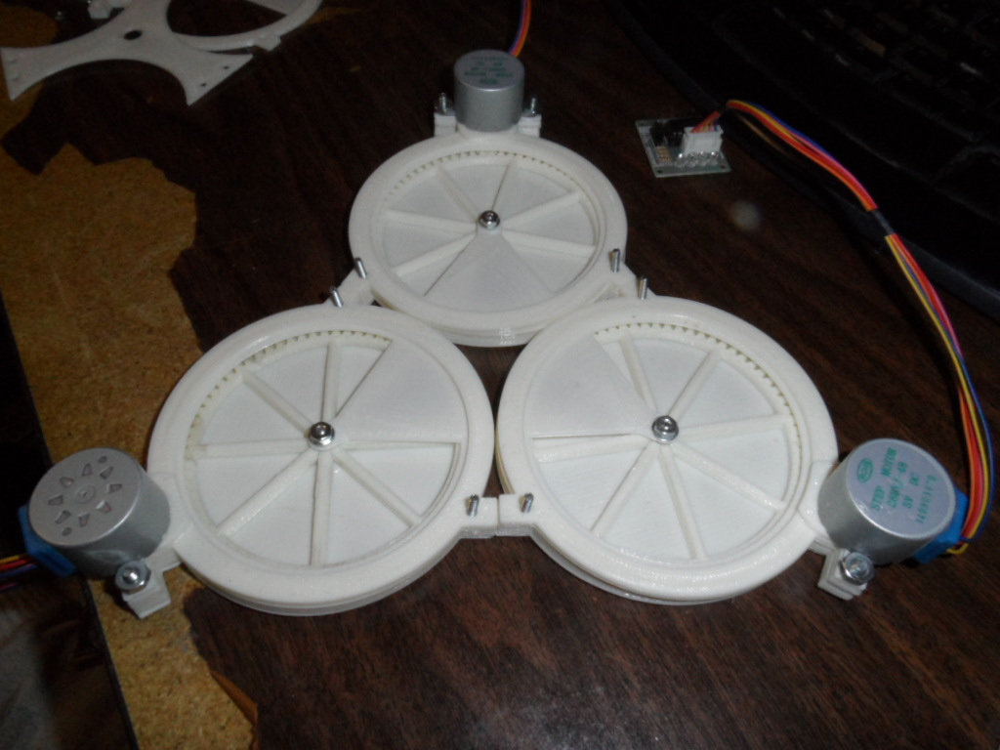
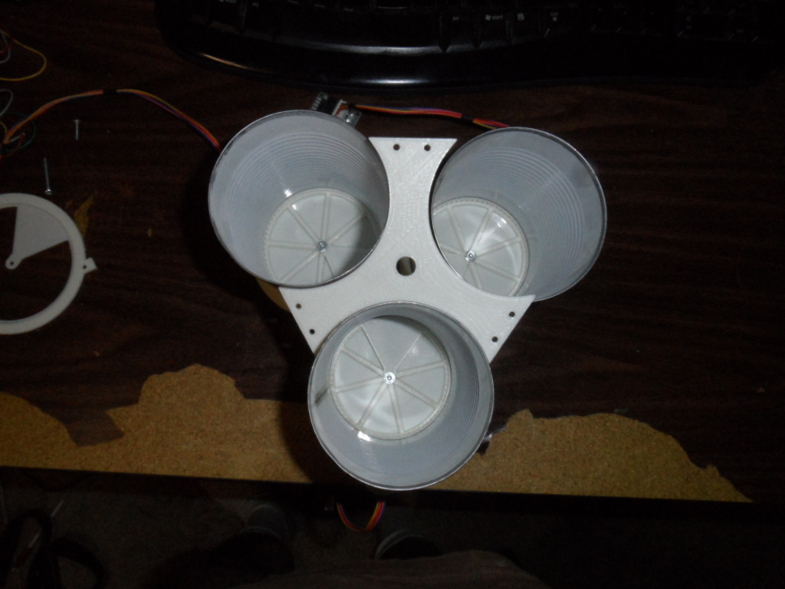
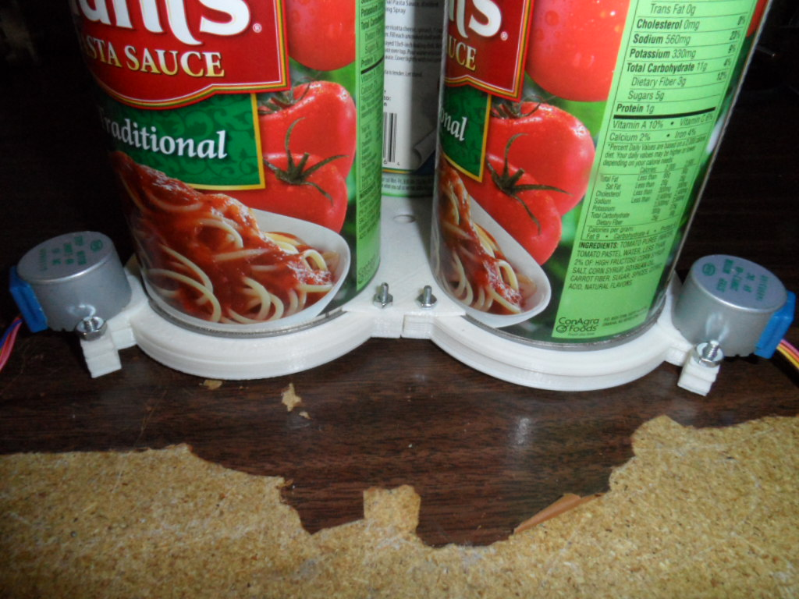
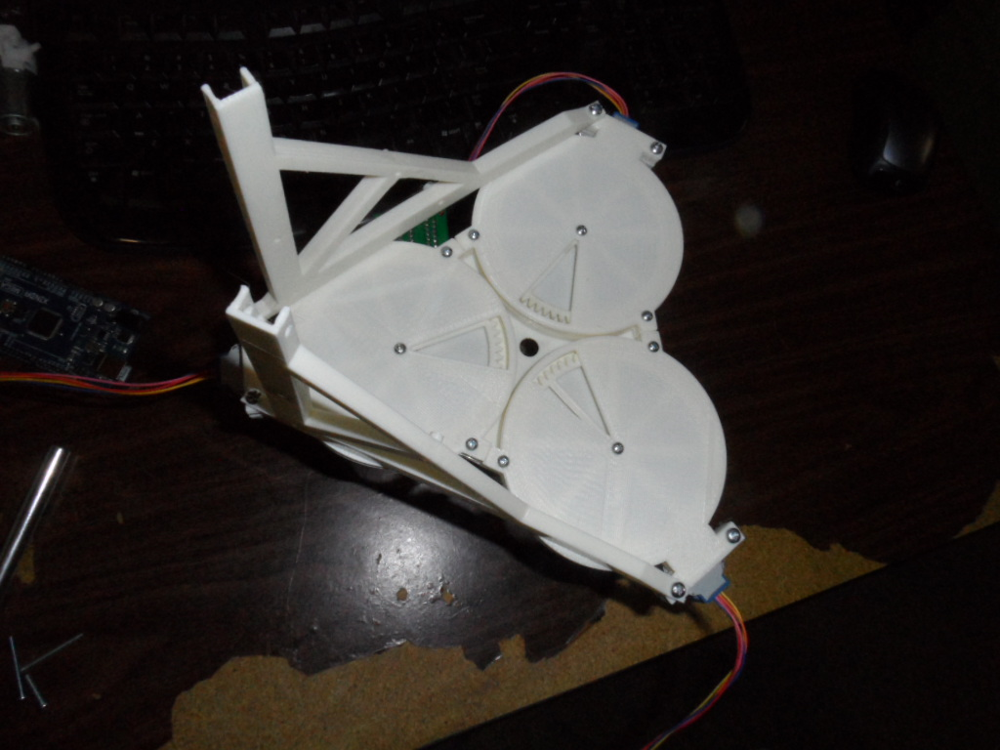

#Building the ArdiChef
### Model-100

-------------------------------------------------------------------------------------
#Overview
-------------------------------------------------------------------------------------
- Features
    - (3) Dry Powder or Granular Ingredient Dispensing
    - Stand
        - Built from 3D Printed Parts
        - Dimensions: 11-1/4" Heigh x 8" Wide x 10-1/2"
        - 6-1/2" Nozzle Clearance
        - Mounting holes for Arduino Mega
        
        
- Example Uses
    - Simple Pancake batter w/o Eggs
    - Coffee Subliment dispensing
        

-------------------------------------------------------------------------------------
#Required Materials
-------------------------------------------------------------------------------------
- Household Items ~$7
    - (3) 86mm Diameter Tin Cans (ie. *Canisters*)
        - Example Items:
            - Hunts Pasta Sauce
            - Cambells Family Size Soup Cans
    - (1) 2-Liter Coca-Cola Brand Plastic Pop Bottle
        - Example Items:
            - 2-Liter Barq Root Beer
            - 2-Liter Sprite
            - 2-Liter Coca-Cola
        
        
- 3D Printed Items
    - (3) Food Dispensers (*ArdiChef Part ID: PD-FBD-28BYJ-86MM*)
    - (4) Stand Legs
    - (3) Funnel Brackets for 2-Liter pop bottle
    - Center Clamp
    - Stand Cross Member
    

- Electronic Hardware ~$44.10
    - Arduino AtMega 2560 Controller Board
        - <a href="http://www.gearbest.com/development-boards/pp_18651.html?currency=USD&gclid=CjwKEAiA18mzBRCo1e_-y_KLpXISJACEsANGLNgAFMSCMaRkQd0qzwwGcqQp3K7xwC0McbJwOJ2JhBoCBg3w_wcB" target="_blank">Arduino Mega $10.75</a>
    - Arduino Ethernet Shield with SD-Card support
        - <a href="http://www.banggood.com/Ethernet-Shield-W5100-Mega2560-R3-ATmega2560-16AU-Kit-For-Arduino-p-957681.html" target="_blank">Arduino Mega w/Ethernet Shield $17.00</a>
    - SD-Card with ability to transfer files
        - <a href="http://www.banggood.com/8GB-Class-10-Micro-SD-Card-TF-Card-With-Card-Adapter-For-Cellphone-p-1009135.html" target="_blank">8GB Class 10 Micro SD with Adapter $6.29</a>
    - Ethernet Cable
        - <a href="http://www.gearbest.com/cables-connectors/pp_68121.html" target="_blank">Retractable Ethernet Cable $1.40</a>
    - (3) 2BYJ-48 5Vdc Step Motor with ULN2003 driver board
        - <a href="http://www.gearbest.com/development-boards/pp_45177.html" target="_blank">28BYJ w/ULN2003 $3.47</a>
    - PC Power Supply
        - <a href="https://www.allhdd.com/power-supply/desktop-power-supply/250-watt/nps-250kb-f-dell-250-watt-power-supply-for-optiplex.-new-pull./" target="_blank">Dell 250W Power Supply Used $9</a>
    
    
- Mechanical Hardware
    - Machine Screws
    - Can Opener
    - Screw driver and Socket or Anything to hold the nut

-----------------------------------------------------------------------------------
##Assembly
-----------------------------------------------------------------------------------
1. Prepare (3) PD-FBD-28BYJ-83MM Food Dispensers
    - Build Instructions at: [../dispensers/PD-PowderDispensers/PD-FBD-28BYJ-86MM/README.md](../dispensers/PD-PowderDispensers/PD-FBD-28BYJ-86MM/README.md)
    </img>
    
2. Attach the Dispensers together into a Triangular Collection
    - Insert #4 Machine Screws upwards in all three dispensor's side fastener holes
    </img>
    - Using a can opener remove both ends of the selected cans
    - Place the cans on top of the (3) dispensers
    - Place the "Center Clamp" in the center of all 3-canisters
    
    </img>
    - Tighten the "Center Clamp" using (6) #4 Nuts
    
    </img>
    - Note: *Sometimes its easier to bolt in one can at a time as long as the result is the same*
    
3. Attach the Stand
    - Using two adjacent motor bolt holes attach the stand legs to the dispenser collection
    </img>
    
3. Attach the 2-Liter bottle as a hopper
    - Cut the 2-Liter bottle in half where the top part of it's label is
    - 

