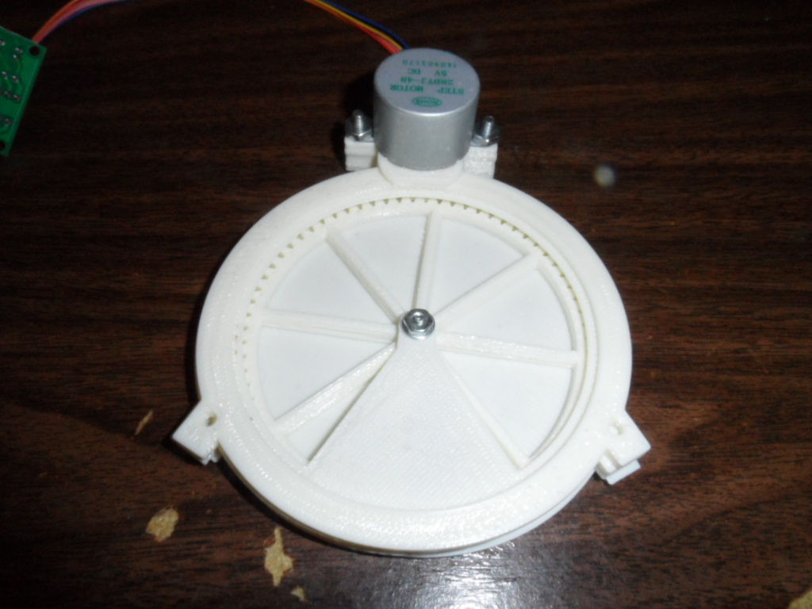
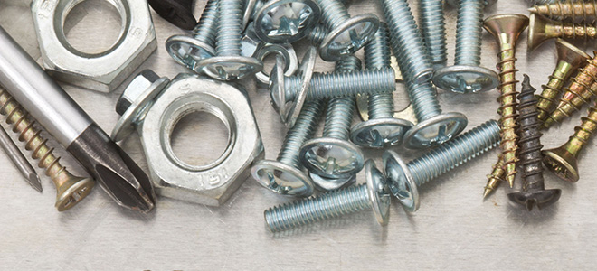
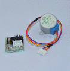
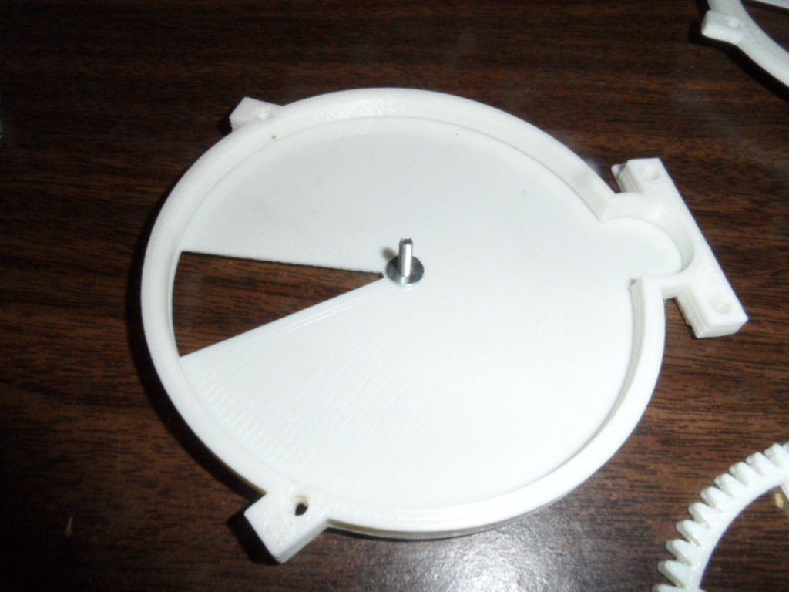
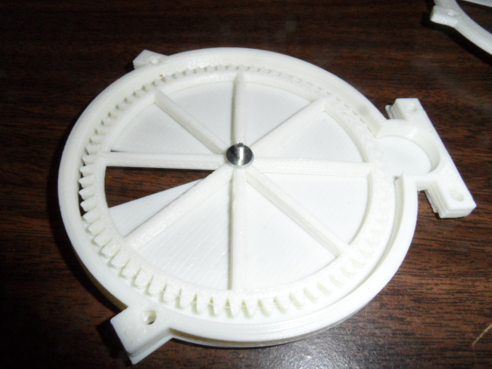
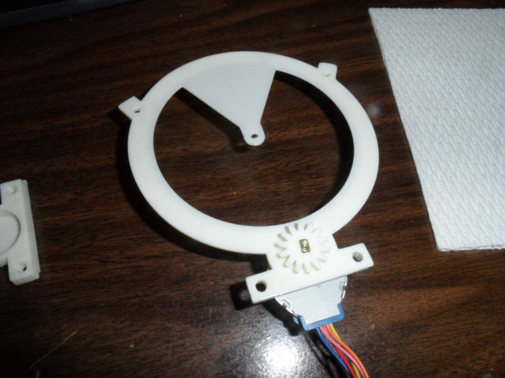
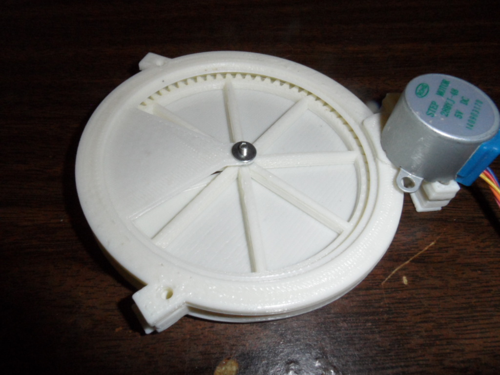

# Assembly Instructions
### For Part: PD-FBD-28BYJ-86MM
</img>

-----------------------------------------------------------------------------------
## Bill Of Materials
-----------------------------------------------------------------------------------
1. 3D Printed Parts
    - Canister Cover
    
    
    - Center Ring
    
    
    - Dispense Gear
    
    
    - Motor Gear
    
    
    - Canister Base
    
    
    
2. Hardware
    - (3) #4 x 3/4" Machine Screws
    - (3) #4 Nuts
    - (3) #4 Flat Washers
    - (2) #6 or #8 x 3/4" Machine Screws
    - (2) #6 or #8 Nuts
    
    
    - 28BYJ-48 Step Motor
    - ULN2003 Step Motor Driver Board
    
    
        
-----------------------------------------------------------------------------------
## Assembly
-----------------------------------------------------------------------------------
1. Place the "Canister Cover" on Work bench (smooth side up)
    - Insert a #4 x 1/2" Bolt upwards through the center
    - Place a #4 flat washer on the bolt
    - Place the "Center Ring" on top of the "Canister Cover"
    
    </img>
    
3. Place the "Dispense Gear" inside the "Center Ring"
    - Place 2 - #4 Flat Washers on top
    
    </img>
    
4. Place Stepper Motor under the Canister Base (Motor meshes with the coarse side - Smooth surface up)
    - Attach the "Motor Gear" to the motor shaft (Smooth surface up)
    
    </img>
    
5. Flip the "Canister Base" with Motor and place on top of the "Center Ring"
    - Attach a #4 Flat Washer on top
    
    </img>
    
6. Fasten the motor to the despenser
    - Use #6 x 3/4" Machine Screws
    
    </img>
    