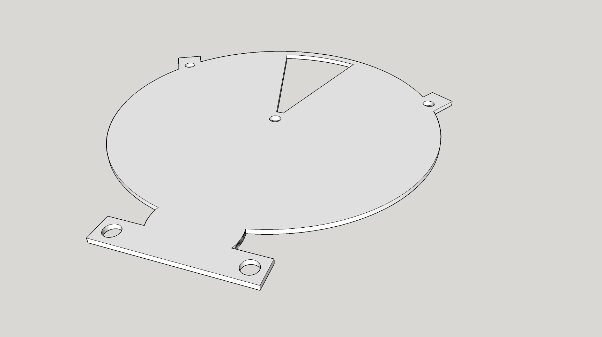
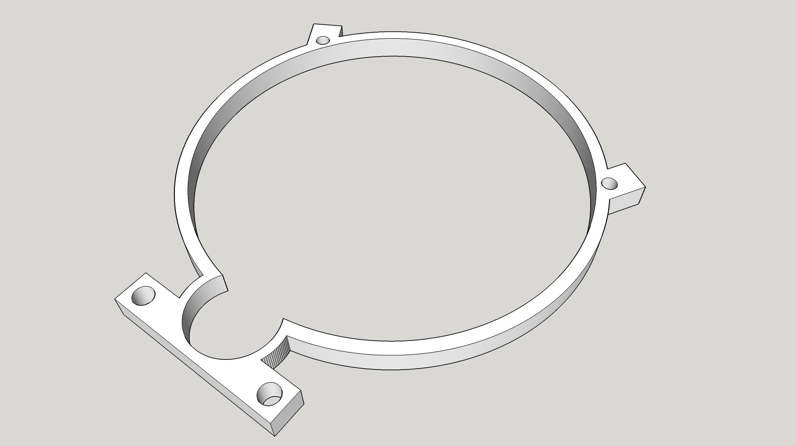
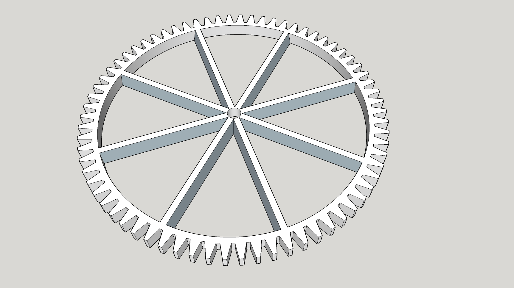
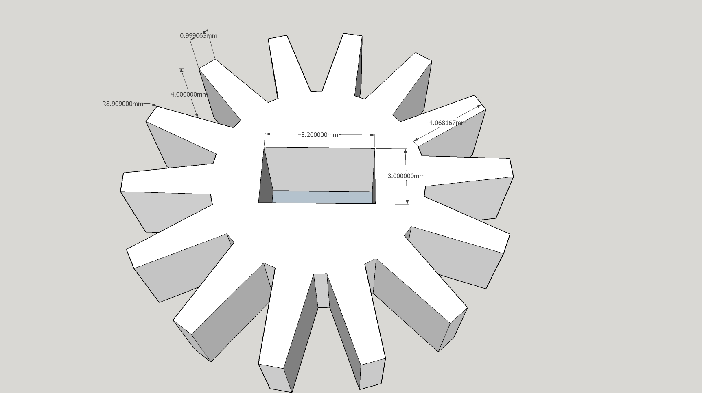
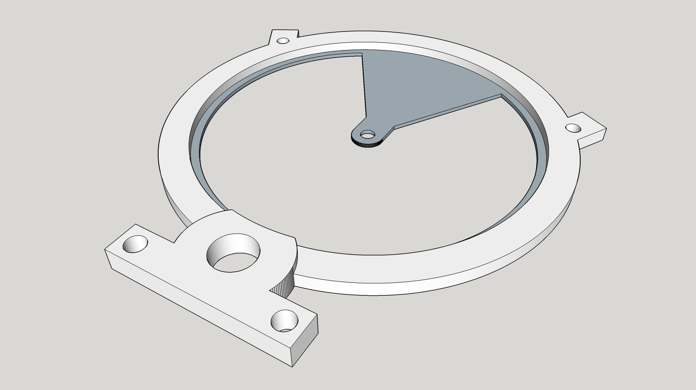
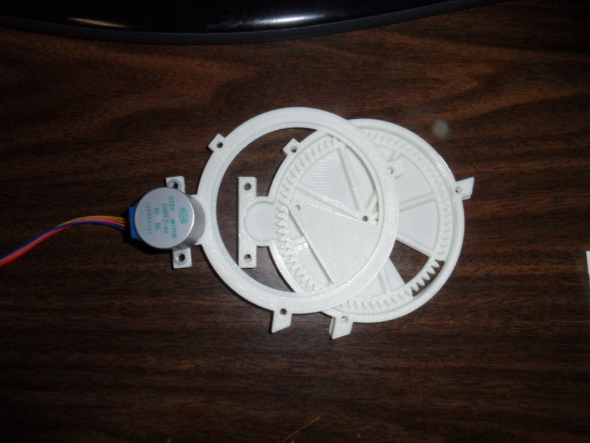

# Assembly Instructions
### For Part: PD-FBD-28BYJ-85MM

-----------------------------------------------------------------------------------
## Bill Of Materials
-----------------------------------------------------------------------------------
1. 3D Printed Parts
    - Canister Cover
    
    
    - Center Ring
    
    
    - Dispense Gear
    
    
    - Motor Gear
    
    
    - Canister Base
    
    
    
2. Other Parts
    - (3) #4 x 3/4" Machine Screws
    - (3) #4 Nuts
    - (3) #4 Flat Washers
    - (2) #6 or #8 x 3/4" Machine Screws
    - (2) #6 or #8 Nuts
    
    
    - 28BYJ-48 Step Motor
    - ULN2003 Step Motor Driver Board
    
    
        
-----------------------------------------------------------------------------------
## Assembly
-----------------------------------------------------------------------------------
1. Place Canister Cover on Work bench
2. Place Center Ring on Canister Cover
3. Place Dispense Gear inside Center Ring
4. Place Stepper Motor inside Canister Base
5. Attach Motor Gear to Stepper Motors Shaft
6. Place Canister Base on top of Center Ring

7. Use #6 or #8 Screws for Mounting the Motor
8. Use #4 Machine Screws for Side Fasteners
