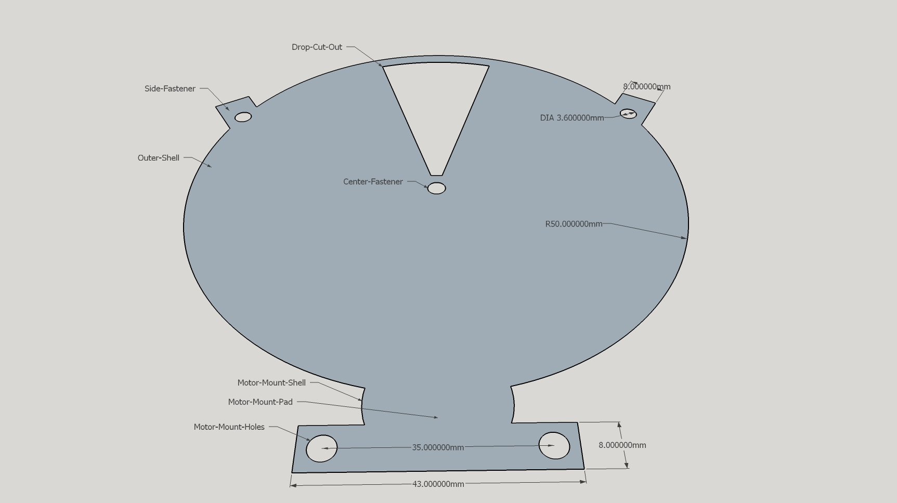
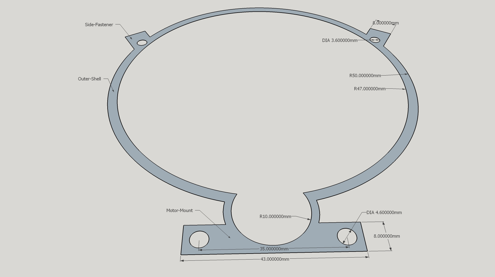
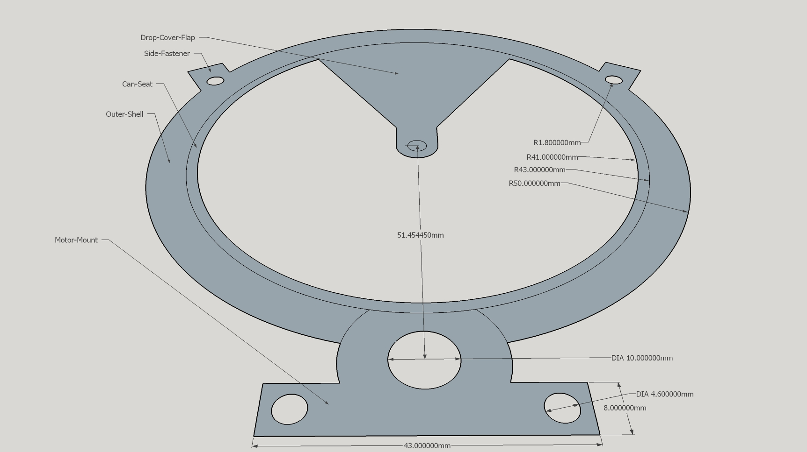

# SketchUp Model Drawing Instructions
### For Part: PD-FBD-28BYJ-85MM

-----------------------------------------------------------------------------------
## Notes
-----------------------------------------------------------------------------------
* Unless otherwise specified
    * Circles are 180-sides proportioned out on the red axis
    
* Abbreviations
    * `South` indicates the light colored axis portion - bottom of origin
    * `@` = at
    * `@+` = at intersection of ? & ?
    * `->` = to
    * `->+` = to intersect
    * `R/L` = Right and Left
    * `^` = Start at ending point of the last drawing just above
    * `#x` = Number of times (example 2x = Draw Two Times)
    * `center` = Main center of an object; associated with other drawing points
    
1. Name of Object
    - Tool @(at) Start Point
        - Length, Radius or End Point
        
-----------------------------------------------------------------------------------
## Canister Cover
-----------------------------------------------------------------------------------
1. Outer-Shell
    - Circle @ Origin
        - 50mm radius

2. Center-Fastener (#4 screw hole)
    - Circle @ origin
        - 1.8mm radius
        
3. Side-Fasteners (#4 screw hole)
    - Protractor @ origin along green axis
        - Right 4-nothes (60&deg;)
        - Left 4-notches (60&deg;)
        - *Guides will be 8-notches apart (120&deg;)*
        
    - Circles `center` @+ Guides & Outer-Shell
        - 1.8mm Radius(2x)

    - Tape @+ South Green & Outer-Shell
        - -> Center of left Side-Fastener circle center
        - -> Center of right Side-Fastener circle center
        
    - Tape @ Side-Fasteners center
        - 7mm along Tape guides(2x) outwards from Outer-Shell
        - Lines ^
            - 4mm Perpendicular R/L
            - Lines ^
                - Perpendicular ->+ Outer-Shell(2x)
    
4. Motor-Shaft-Shell
    - Calculate
        - (Dispense Gear Outer Radius) + (Motor Gear outer Radius) - (2mm mesh together)
        - (44.54545mm) + (8.909mm) - (2mm) = 51.45445mm
    - Tape @ Origin
        - 51.45mm along South green axis to mark `center`
        - Circles ^
            - 10mm Radius
            - 12mm Radius
    
5. Motor-Mount-Holes
    - Tape @ Motor-Shaft-Shell center
        - 8mm along South green axis
        - Tape ^
            - 17.5mm Perpendicular R/L to mark `center`
            - Circles ^
                - 2.3mm Radius (#6 screw hole)
                
6. Motor-Mount-Pad
    - Tape @ Motor-Mount-Hole centers(2x)
        - 4mm (Up and Right) / (Down and Left)
        - Rectangle ^
    
    *At this point delete all the guides and clean up the drawing as shown*
    
    
7. Drop-Cut-Out
    - Circle @ origin
        - 47mm radius
    - Line @ origin
        - -> 8 circle sides R/L of Green axis
        - *end-point to end-point (opening) should be 25.9mm*
    - Tape @ origin
        - 4mm along green axis
        - Line ^
            - Perpendicular R/L ->+ Drop-Cut-Out lines
    *Clean up the drawing *
    
8. Finish
    - Push @ Canister Cover Model
        - 1.5mm Tall

-----------------------------------------------------------------------
#CENTER RING
-----------------------------------------------------------------------
1. Outer-Shell
    - Circle @ origin
        - 50mm radius
        
2. Inner-Shell
    - Circle @ origin
        - 47mm radius
        
3. Side-Fasteners (preform Canister Cover Step #3)
4. Motor-Mount (preform Canister Cover Steps #4,5,6)

    *At this point delete all the guides and clean up the drawing as shown leaving 3mm outer edges*
    

8. Finish
    - Push @ Center Ring Model
        - 6mm Tall

-----------------------------------------------------------------------
#CANISTER BASE (83MM)
-----------------------------------------------------------------------
1. Outer-Shell
    - Circle @ origin
        - 50mm radius
        - 43mm radius

2. Can-Seat
    - Circle @ origin
        - 41mm radius
        
3. Side-Fasteners (preform Canister Cover Step #3)
4. Motor-Mount (preform Canister Cover Steps #4,5,6)
    - Circle @ Motor-Shaft-Shell center
        - 5mm radius

5. Drop-Cover-Flap
    - Protractor @ origin
        - 32&deg; L/R of green axis
        - Lines @ origin
            - ->+ Inner-Shell along protractor guides
    - Circle @ origin
        - 1.8mm radius
        - 4mm radius
        - Lines @+ Red Axis & ^
            - ->+ Protractor Lines

    *At this point delete all the guides and clean up the drawing as shown*
    

6. Finish
    - Push @ Motor-Mount
        - 5.5mm Tall
        - Move @ Circle Section +Outer-Shells inner circle & Motor-Mount
            - 1mm Towards origin (*Supply a lip over the Can-Seat to hold canister*)
    - Push @ Outer-Shell
        - 3.5mm Tall
    - Push @ Can-Seat
        - 1mm Tall
    
    
    
    
    