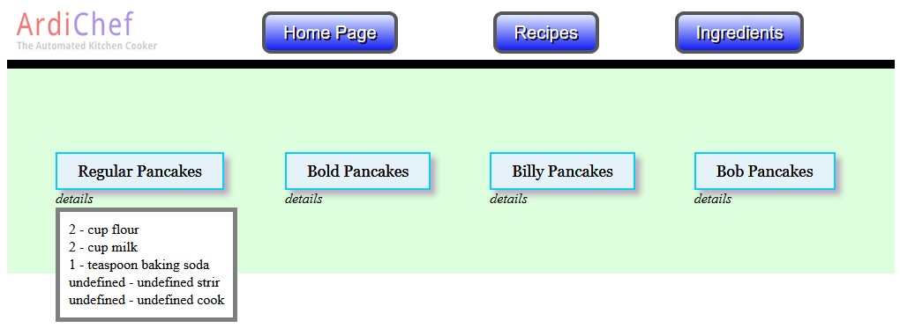

# Software
#####For the ArdiChef Project
</img>

-------------------------------------------------------------------------------------
##Choosing a Hardware Configuration
-------------------------------------------------------------------------------------
1. ArdiChef will support various hardware configurations to meet complexity needs
    - Single Arduino Board
    - Single Arduino Board with Ethernet Shield (*SUGGESTED*)
    - One Arduino Board and one Rasberry Pi
    - Multiple Arduino Boards with a "master" Arduino Board with an Ethernet Shield
    - Multiple Arduino Boards with one Rasberry Pi

-------------------------------------------------------------------------------------
##Software Installation ( Single Arduino with Ethernet )
-------------------------------------------------------------------------------------
1. Arduino Setup
    - Load ArdiChefController into Arduino Sketch
    - Set Pre-Compiler Directives
        - IP Adress
        - Gateway
        - Subnet
    - Compile and Upload to the Arduino
    
    - Setup the EWS
        - Copy all files within the EWS folder to the Ethernet Shield SD-Card
        - Plug the card back into the Ethernet Shield
        
-------------------------------------------------------------------------------------
##Architecture
-------------------------------------------------------------------------------------
- The main components of ArdiChef Software include
    - A **Storage** device
    - An Embedded Web Server (**EWS**) to host the files on the storage device
    - A Web **Browser** that supports Javascript for the User Interface
    - I2C or Serial **Communications** (*For Multiple Arduino Boards*)
    - **Ports** Dispatch/Pin routing and Various Motor/Heat/Other Driving objects (*Always on Arduino*)
   
   
- Single Arduino Board Configuration (*Still In Development*)
    - Storage = Recipe & Ingredient files reside locally on a USB attached home PC.
    - EWS = Files are hosted on the home PC
    - Browser = Any javascript enabled web browser on the home PC
    - Communications = USB -> |Firmata/Serial| -> Arduino
    - Ports = "ArdiChefController" Arduino Sketch

    
- Single Arduino Board with Ethernet Shield
    - Storage = Micro SD-Card
    - EWS = Arduino
    - Browser = Any Browser on the local network (ie. Home PC or Cell Phone)
    - Ports = "ArdiChefController" Arduino Sketch
    
    
- Single Arduino and Rasberry Pi (*Still In Development*)
    - Storage = Rasberry Pi
    - EWS = Rasberry Pi
    - Browser = Rasberry Pi (*Likely equiped with a touchscreen*) and/or Any Browser on the network
    - Ports = "ArdiChefController" Arduino Sketch
    
    
- Multiple Arduino Boards with a "Master" Arduino w/Ethernet (*Still In Development*)
    - Storage = Micro SD-Card on Ethernet Shield
    - EWS = "Master" Arduino Board
    - Browser = Home PC or Cell on the network
    - Ports = "ArdiChefController" Arduino Sketch loaded on every Arduino Board Used
    
-------------------------------------------------------------------------------------
#Folders
-------------------------------------------------------------------------------------
| Folder                     | Contents |
| -------------------------- | -------------|
| /ArdiChefController        | Main Control software for Arduino Board(s) |
| /EWS (Embedded Web Server) | The files that make up the web based user interface |
| /WebServerST_Plus          | Arduino Sketch for the Arduino Ethernet shield enabling EWS hosting |